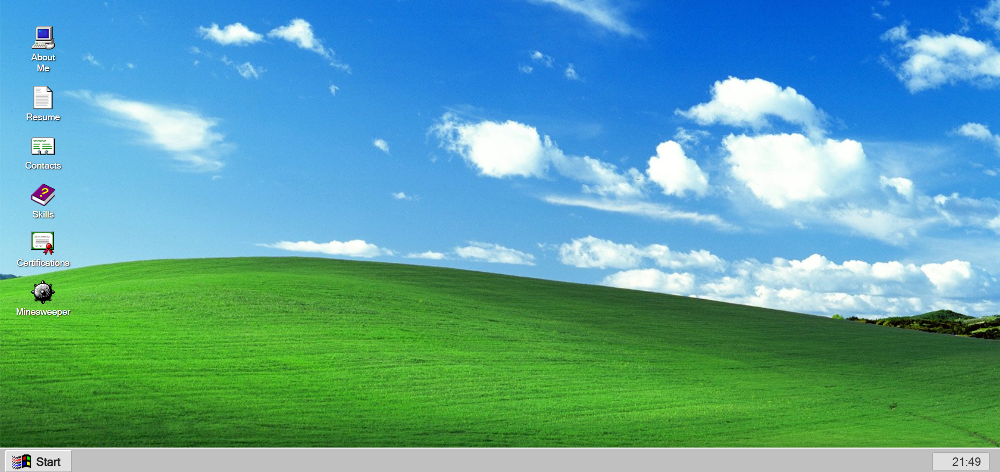

# Windows 99 Portfolio Website

A unique, interactive personal portfolio website designed with a nostalgic Windows 9x/XP desktop aesthetic. This project transforms a standard resume into a fun, retro computing experience.



## 📖 About The Project

This project is a frontend portfolio website that mimicks the look and feel of a classic Windows operating system. The iconic "Bliss" wallpaper combined with a retro taskbar and pixelated icons provides an engaging way for visitors to explore my professional background.

Instead of standard navigation bars, users interact with desktop icons to "launch" different sections of my portfolio.

### Key Features

* **Retro Interface:** Authentic classic Windows taskbar, start menu button, and desktop environment.
* **Interactive Navigation:** Desktop icons serve as links to resume sections.
* **Sections Included:**
    * 📄 About Me
    * 💼 Resume
    * 📞 Contacts
    * 🛠️ Skills
    * 📜 Certifications
    * 💣 Minesweeper (Interactive game element)

## 🛠️ Built With

This project uses modern web technologies to recreate a vintage feel.

* [](https://developer.mozilla.org/en-US/docs/Web/Guide/HTML/HTML5)
* [](https://developer.mozilla.org/en-US/docs/Web/CSS)
* [](https://developer.mozilla.org/en-US/docs/Web/JavaScript)

## 💻 Getting Started

To run this project locally on your machine, follow these steps.

### Prerequisites

Make sure you have Node.js installed to manage dependencies.

### Installation

1.  **Clone the repository**
    ```bash
    git clone [https://github.com/sagnikdatta2k6/WIN98-PORTFOLIO.git](https://github.com/sagnikdatta2k6/WIN98-PORTFOLIO.git)
    ```
2.  **Navigate into the project directory**
    ```bash
    cd WIN98-PORTFOLIO
    ```
3.  **Install dependencies (Tailwind CSS)**
    ```bash
    npm install
    ```
4.  Open the `index.html` file in your browser to view the site.

## 🖱️ Usage

Simply click on the desktop icons just as you would on a real computer to navigate through the different sections of the portfolio.

## 📄 License

Distributed under the MIT License. See `LICENSE` for more information.

## 📮 Contact

Sagnik Datta - sagnik.datta111@gmail.com

Project Link: [https://github.com/sagnikdatta2k6/WIN98-PORTFOLIO](https://github.com/sagnikdatta2k6/WIN98-PORTFOLIO)
